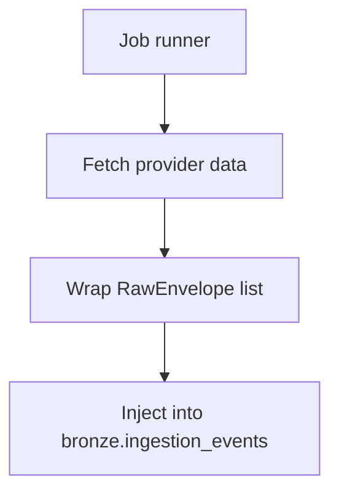

# Orchestration Module

This module runs ingestion jobs with simple functional runners and job factories:

- Fetch envelopes from the provider.
- Inject envelopes into bronze storage.

## Job Factory Usage
Create job callables by passing the asset identifier and explicit backfill parameters:

```python
from orchestration import (
  OrchestrationConfig,
  make_coingecko_job,
  make_yfinance_job,
)

config = OrchestrationConfig()

btc_job = make_coingecko_job("bitcoin", days="7", asset="BTC")
sp500_job = make_yfinance_job(
  "^GSPC",
  job_name="yfinance_sp500",
  start_date="2023-12-31",
  end_date="2024-01-10",
  currency="usd",
  asset="SP500",
)

btc_job(config)
sp500_job(config)
```

## Orchestration Flow Diagram

